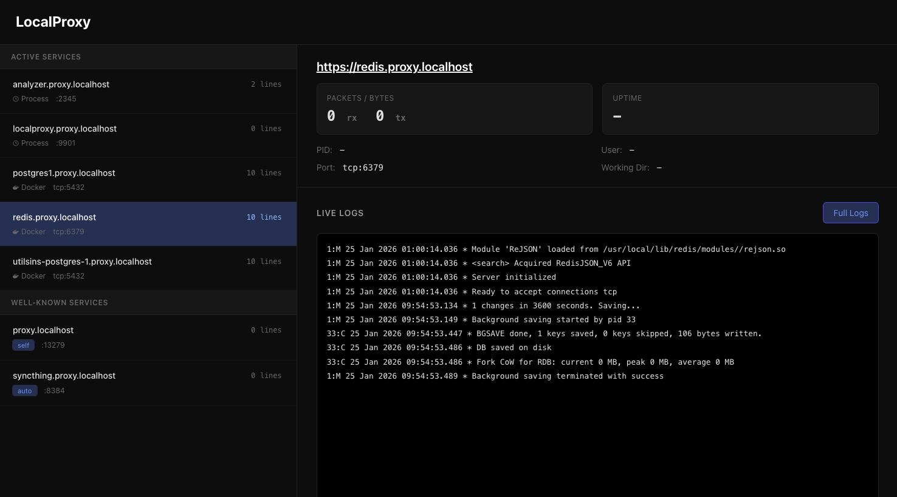

# Localproxy

[](https://github.com/Xetera/localproxy/actions/workflows/build.yml)

```sh
cd ~/projects/coolproject
PORT=$(random) npm run dev
curl https://coolproject.localhost
# ✨ it just works like magic
```



I hate having to remember random port numbers. Localproxy solves this problem for me. It runs an embedded caddy server on port 80 and 443 with a self-signed certificate, and auto-discovers targets from both docker using `EXPOSE` fields and [labels](#docker-example-with-labels), and local processes listening to ports running directly under a given "projects" folder.

Localproxy supports proxying http(s), http/2, http/3 (QUIC) and TCP connections. If there's more than one service running on the same port (ex: 2 postgres databases listening on port 5432), the TCP connections MUST use TLS to allow the proxy to determine the target domain. Otherwise that information is missing without a layer 7 protocol involved (ex: redis with `--tls --sni` and postgres with `?sslnegotiation=direct&sslmode=require`)

Certain well-known ports on your computer are also checked to detect software you may have running locally outside your regular "projects" folder like syncthing, to also proxy connections there as well.

---

Sadly, the project requires root privileges on macos because:

1. Unlike Linux, On MacOS, docker runs on top of a Linux VM. Which makes reaching into docker ports impossible without having root access. There's really no good workaround for this that I know of.
2. MacOS for whatever reason does not automatically map `*.localhost` to 127.0.0.1. To allow this mapping, localproxy reaches into `/etc/hosts` to add entries just because it's the simplest alternative since we already need root.
3. [There's a bug that prevents listening to privileged ports on specific interfaces without root](https://news.ycombinator.com/item?id=18302380). That's right, you can listen to port 80 on `0.0.0.0` but not `127.0.0.1`.

If you don't need docker integration in macos, you can run without root after doing a small setup to allow resolving localhost and internal tlds.

```
brew install dnsmasq
echo 'address=/.localhost/127.0.0.1' >> $(brew --prefix)/etc/dnsmasq.conf
echo 'address=/.internal/127.0.0.1' >> $(brew --prefix)/etc/dnsmasq.conf
sudo brew services start dnsmasq
```

```sh
sudo CGO_ENABLED=0 go run ./cmd/localproxyd --watch ~/myprojects
```

Then navigate to the dashboard https://localhost

#### Flags

- `--watch` Adds a folder to watch for processes. Local process watching is disabled if no folders are watched.
- `--https-redirect` Force https redirects for all created endpoints (default: false)
- `--log-level` Log level for the caddy server. `error`, `info`, `debug` (default: info)
- `--trace-process-logs` Show logs from external processes on the dashboard using dtrace on macOS. Requires disabling SIP. This WILL eventually lock up your system badly enough for you to hold down the power button for a restart [unless you're on Tahoe](https://news.ycombinator.com/item?id=45974681) (default: false)

### Local process example

```sh
cd ~/myprojects/project1
# run a webserver on any port
npm run dev
# localproxy uses the path passed to --watch to
# automatically detect processes running in its sub-folders
curl https://project1.localhost
```

## Docker

Proxying traffic to docker containers works without exposing ports using `-p`. Instead you can use the following labels to configure the proxy behavior:

- `localproxy.subdomain` controls the [subdomain].internal domain
- `localproxy.port` 443/80 -> $port (used for webservers)
- `localproxy.tcpport` $tcpport -> $tcpport (used for for tcp servers that listen non non-web ports)

Proxying traffic _from inside_ docker containers is a little bit tricker. Unsurprisingly, `127.0.0.1` does not point to the host from within containers. To allow resolving localproxy domains from inside containers, you will need to configure docker to reach out to localproxy's DNS server that you enable with `--dns-server-port 53`. Although the port is configurable, you'll want port 53 as that's not configurable for DNS resolution in docker.

### Regular Docker (Linux)

Edit `~/.docker/daemon.json` to include the dns field along with a fallback to make sure docker continues running if localproxy turns off.

```json
{
  "dns": ["127.0.0.1", "9.9.9.9"]
}
```

### Orbstack (MacOS)

Docker on MacOS has a linux VM layer and orbstack specifically uses `~/.orbstack/config/docker.json`. Because of the VM, you can either point it to the bridge IP (192.168.139.3 for me currently) but that's prone to being re-assigned. So I instead set it as my computer's private IP which is 10.0.0.185 for me but will be something different for you.

You can run `ipconfig getifaddr en0` to find your address.

```json
{
  "dns": ["10.0.0.185", "9.9.9.9"]
}
```

### Windows

TBA

#### Working with Postgres

There's no specific configuration required for Postgres. But if you want to run more than one postgres instance on port 5432 you will need a way to route traffic to the right database on the domain name (SNI field in TLS handshakes).

```sh
docker run --name db -l localproxy.tcpport=5432 -e POSTGRES_HOST_AUTH_METHOD=trust postgres
```

Two requirements for connection:

1. `sslmode` has to be `require` to not attempt a plaintext connection
2. `sslnegotiation` has to be `direct` to use TLS instead of STARTTLS which Caddy doesn't support

```sh
psql "postgresql://postgres@db.localhost/postgres?sslmode=require&sslnegotiation=direct"
```

#### Working with Redis

```sh
docker run --name myredis -l localproxy.tcpport=6379 redis
```

Connect to it from the host without exposing ports. Sadly redis-cli doesn't seem to use the local trust chain on macos. You may be able to omit `--insecure` on other platforms.

```sh
redis-cli --tls --insecure -h myredis.localhost --sni myredis.localhost
# If you want to explicitly verify the certificate
redis-cli --tls --cacert "$(mkcert -CAROOT)/rootCA.pem" -h myredis.localhost --sni myredis.localhost
```
